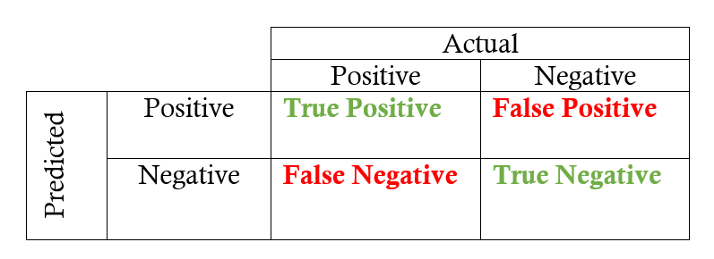
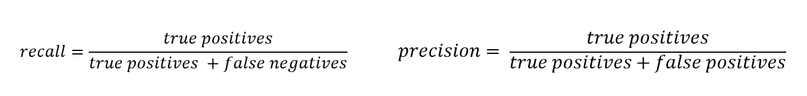

## What is machine learning?
Machine learning (also referred to as predictive analytics or predictive modeling) is branch of artificial intelligence that uses statistics to extract patterns from big datasets. In a nutshell, machine learning algorithms are designed to identify and apply the most important/descriptive features of your data.

### Types of learning algorithms:  
1. **Supervised** -> contains the target/response variable being models, where the goal is to predict the value or class of unseen data (i.e., linear regression, decisions trees, nearest neighbor methods, support vector machines, Bayesian classifiers)  
2. **Unsupervised** -> dataset contains no target/response variable (unlabeled data), more about finding patterns than prediction (i.e., k-means clustering or hierarchical clustering)  
3. **Semi-supervised** --> uses a very small amount of labeled data and a large amount of unlabeled data, with the goal being to infer the correct labels for the unlabeled set  

### Modern applications of machine learning:  
1. Image recognition (iPhone face recognition)  
2. Voice recognition (Alexa or Siri)  
3. Recommendation engines (your Netflix account)  
4. High-throughput microscopy  
5. Drug discovery  
6. Protein interactions  

Today, we're going to use a sort of "all-inclusive" R package for machine learning to build and test our legendary Pokemon model. 
http://topepo.github.io/caret/index.html

Not only does caret allow you to run a wide range of ML methods, but it also provides built-in functionality for auxiliary techniques such as:  
1. Data preparation  
2. Data splitting  
3. Variable selection  
4. Model evaluation  

## Setting up the environment

First we need to set up how we want our output to look (knitr, a feature of R Markdown, will take care of this for us) and install/load the R packages we will need for our experiment today.

**PRO-TIP: you can execute a single line of code with the shortcut 'Ctrl+Enter' or a whole chunk of code with 'Ctrl+Shift+Enter'**

```{r setup, echo=T, results='hide', message=F, warning=F}


#install.packages("tidyverse")
#install.packages("skimr")
#install.packages("caret")
#install.packages("RANN")
#install.packages("plotly")
#install.packages("yardstick")


library(tidyverse) # collection of packages for easy data import, tidying, manipulation and visualization
library(skimr) # package for getting dataset stats at a glance
library(caret) # package for "Classification And REgression Training"
library(RANN) # required for some caret functionalities
library(plotly) # package for interacting with plots
library(yardstick) # package for evaluating statistical models

setwd("/stor/work/Marcotte/project/rmcox/github_repos/pokemon_machine_learning_demo/")

```


## Importing and exploring the data

Next we will need to load the Pokemon data into our environment. This is a publicly available dataset scraped a couple years ago from http://serebii.net/ and contains information on the 802 Pokemon comprising Generations 1-7. 

The information contained in this dataset include Base Stats, Performance against Other Types, Height, Weight, Classification, Egg Steps, Experience Points, Abilities, etc.

**PRO-TIP: you can make a pipe (%>%) with the shortcut 'Ctrl+Shift+M'**

```{r data exploration and preprocessing}

# The read_csv() function loads in the data and automatically detects it as comma-delimited.
poke_data <- read_csv("pokemon_data_all.csv", col_names=TRUE) %>%
  select(name, everything()) 

# The glimpse() function is nice for looking at all the variable names and types.
# You can see there are 801 pokemon ("observations") and 41 features ("variables").
glimpse(poke_data) 

# The head() function lets us look at the first few rows of the dataframe and its format.
head(poke_data)

# Luckily our dataset is already in the right format, with individual observations as rows and features as columns.
# If this were not the case, we would have to use gather() or spread() to get it in the right format.

# Some of these variables are not going to be helpful for training our model. E.g., "name" is always unique, "japanese name" is always unique, "abilities" are nearly always unique and "classification" are nearly always unique. Let's take these out for simplicity's sake.
poke_data <- poke_data %>%
  select(-japanese_name, -abilities, -classfication)

# Also right now, legendary status is described with 1's and 0's so let's change that to TRUE and FALSE.
poke_data <- poke_data %>%
  mutate(is_legendary = as.logical(is_legendary))

# The next step is to look for missing data, a common problem in big datasets. The skimr package provides a nice solution for this, along with showing key descriptive stats for each column.
skim(poke_data)

# In our columns with character values, almost half the data set is missing a value for "type2."
# If you're familiar with Pokemon, you know that's perfectly valid for a Pokemon to only have one type.
# Since the characteristic of only having one type might be important to a Pokemon's legendary status, we can feel justified in replacing all the "NA" values in the "type2" column to "none."
poke_data$type2[is.na(poke_data$type2)] <- "none"

# We also have missing values in our numeric columns. Let's check out how many legendary Pokemon are affected by this missing data.
poke_data %>% filter(is.na(weight_kg)) %>% tally(is_legendary > 0)
poke_data %>% filter(is.na(height_m)) %>% tally(is_legendary > 0)
poke_data %>% filter(is.na(percentage_male)) %>% tally(is_legendary > 0)

# Let's remove the problematic "percentage_male" column. See text below for explanation.
poke_data <- poke_data %>%
  select(-percentage_male)

# Plot the relationship of non-legendary vs legendary Pokemon among the variables.
ggplot(poke_data, aes(x=type1)) +
  geom_bar(aes(fill=is_legendary, group=is_legendary)) +
  coord_flip()

ggplot(poke_data, aes(x=weight_kg, y=height_m, color=is_legendary)) +
  geom_point(size=3, alpha=0.5)

# Plot the distrbution of the target (or response) variable and see if there is any class imbalance.
ggplot(poke_data, aes(x=is_legendary)) +
  geom_bar() +
  xlab("Legendary status") +
  ylab("# Pokemon")


```

Missing values in the "percentage_male" column is particularly problematic, since there are a lot of legendary Pokemon in this subset. The reason for this is that legendary Pokemon are commonly genderless. 

We can't replace N/A with "none" like we did with the types above, because then we would be mixing numeric and character values. We can't replace N/A with 0, because then that would imply 100% female, which is false. We can't impute it, because it will predict a value between 0 and 100, which is also incorrect.

## Splitting the dataset for training and testing

We need to split the dataset into training data (75%) and test data (25%). When building the predictive model, the algorithm should see the training data and **ONLY** the training data to learn the relationship between Pokemon stats and their legendary status. Learned information about these relationships become our machine learning model.

```{r partition data set}

# Now let's divide the dataset into training and test sets. The caret package has a nice function, createDataPartition(), for this purpose.

set.seed(13)

partition_index <- createDataPartition(poke_data$is_legendary, p=0.75, list=FALSE)

trainPoke <- poke_data[partition_index,]

testPoke <- poke_data[-partition_index,]

```

## Dealing with missing data

There is no one-size-fits-all method for dealing with missing data. I found a nice overview for the different ways you can deal with missing values in predictive analytics in a data science blog (https://towardsdatascience.com/how-to-handle-missing-data-8646b18db0d4):


The missing values in the "weight_kg" and "height_m" columns are less complex to deal with. These missing values represent a smaller portion of the dataset, and result from a bug in the web scraping script used to generate the csv.

Let's take this as an opportunity to demonstrate what imputation, or value prediction, might look like. We can impute the missing values by considering the rest of the available variables as predictors using the k-Nearest Neighbors algorithm. Luckily caret has a built-in function for this, preProcess(). 

Before we do that, we need to partition our data into training and test sets. We want our test set to be **completely independent** of our training set, and that includes participation in imputation.

```{r missing data}

# The "name" column is not important to model training, so let's take it out to avoid having to encode the labels.
trainPoke <- trainPoke %>%
  select(-name) %>%
  mutate(is_legendary = as.factor(is_legendary))

# Now let's make a model for predicting the missing values in the weight and height columns.
poke_missingdata_model <- preProcess(trainPoke, method='knnImpute')

poke_missingdata_model

# The output shows that the model has centered (substracted by mean) 33 variables, ignored 3 variables, used k=5 (considered 5 nearest neighbors) to predict missing values and finally scaled (divide by standard deviation) 33 variables.

# Now let's use this model to predict the missing values.
trainPoke_pp <- predict(poke_missingdata_model, newdata = trainPoke)

# Check to see if any N/A values remain. If FALSE, all values have been successfully imputed.
anyNA(trainPoke_pp)

# We can also revisit the skim() function to confirm no missing values are present.
skim(trainPoke_pp)

```


## Categorical variables in machine learning

Categorical data are variables that contain character values rather than numeric values. For instance, Pokemon types are categories like "fairy" and "fire." Many machine learning algorithms don't operate on category data directly, requiring all input and output variable to be numeric. 

However, the tree-based algorithms we're going to use handle it just fine, so we're not going to bother with it here.


## Training the model

There are many, many different machine learning algorithms (for both classification and regression) available via the caret package. For today's demo, we will be training a Random Forest model because it plays nice with categorical data and datasets with imbalanced classes.

With any machine learning model, we need some kind of assurance that the model has extracted most of the patterns from the data correctly. We need to make sure that its not picking up too much noise, i.e., the model has low bias and variance. This process is known as **validation**. To figure out how well our classifier will generalize to an independent/unseen dataset, we'll use **k-fold cross validation**. This method divides the training data in k subsets. Then, one of the k substs is used as the test set and the other k-1 subsets are put together to form a training set. This is repeated k times.

Since every data point gets to be in a validation set exactly once, and gets to be in a training set k-1 times, this signficantly reduces the bias (as we use most of the data for fitting) and variance (as most of the data is also being used in validation).

```{r model training}

# designate validation method
fitControl <- trainControl(method="repeatedcv", number=5,
                           repeats=5)


# fit a "Random Forest" model; ~206.871 seconds
pokeFit_ranf <- train(is_legendary~., data=trainPoke_pp, method = "rf",
                    trControl=fitControl)

pokeFit_ranf
varimp_ranf <- varImp(pokeFit_ranf)
ggplot(varimp_ranf)


```


```{r predict on test data}

testPoke_pp <- predict(poke_missingdata_model, testPoke) %>%
  mutate(is_legendary=as.factor(is_legendary))
  
anyNA(testPoke_pp)

predictionPoke <- predict(pokeFit_ranf, testPoke_pp)
predictionPoke

testPoke_pp$predicted <- predict(pokeFit_ranf, testPoke_pp)

target_outcomes <- testPoke_pp %>% 
  select(name, is_legendary, predicted) %>%
  arrange(desc(is_legendary), desc(predicted))

confusionMatrix(reference=testPoke_pp$is_legendary, data=predictionPoke, mode='everything', positive='TRUE')


```

## Evaluating your model

A confusion matrix is a table that is often used to describe the performance of a classifier on a set of test data for which the true values are known. This is the basic structure:


Confusion matrices are used to calculate precision and recall, like so:


Here is a list of definitions for the rates that are often computed to evaluate a binary classifier (like ours):

1. **Accuracy** -> how often the classifier is correct overall
2. **True Positive Rate** -> when the answer is yes, how often does it predict yes? AKA as **sensitivity** or **recall** (TP/(TP+TN))
3. **False Positive Rate** -> when the answer is no, how often does it predict yes?
4. **True Negative Rate** -> when the answer is no, how often does it predict no?
5. **Precision** -> when it predicts yes, how often is it correct? (TP/(TP+FP))
6. **Prevalence** -> how often does the yes condition actually occur in our sample?
7. **Null Error Rate** -> how often you would be wrong if you always predicted the majority class
8. **Kappa** -> how well the classifier performed compared to how well it would have performed simply by chance; in other words, a model will have a high Kappa score if there is a big difference between the accuracy and null error rate
8. **F score** -> weighted average of the true positive rate (recall) and precision


```{r removing the most important feature}

### remove feature
poke_data_noegg <- poke_data %>%
  select(-base_egg_steps)

### split data
set.seed(13)

partition_index_noegg <- createDataPartition(poke_data_noegg$is_legendary, p=0.75, list=FALSE)

trainPoke_noegg <- poke_data_noegg[partition_index,]

testPoke_noegg <- poke_data_noegg[-partition_index,]

### train model
trainPoke_noegg <- trainPoke_noegg %>%
  select(-name) %>%
  mutate(is_legendary = as.factor(is_legendary))

poke_missingdata_model_noegg <- preProcess(trainPoke_noegg, method='knnImpute')

trainPoke_pp_noegg <- predict(poke_missingdata_model_noegg, newdata = trainPoke_noegg)

pokeFit_ranf_noegg <- train(is_legendary~., data=trainPoke_pp_noegg, method = "rf",
                    trControl=fitControl)

varimp_ranf_noegg <- varImp(pokeFit_ranf_noegg)
ggplot(varimp_ranf_noegg)

### test model
testPoke_pp_noegg <- predict(poke_missingdata_model_noegg, testPoke_noegg) %>%
  mutate(is_legendary=as.factor(is_legendary))
  
anyNA(testPoke_pp_noegg)

predictionPoke_noegg <- predict(pokeFit_ranf_noegg, testPoke_pp_noegg)

testPoke_pp_noegg$predicted <- predict(pokeFit_ranf_noegg, testPoke_pp_noegg)

target_outcomes_noegg <- testPoke_pp_noegg %>% 
  select(name, is_legendary, predicted) %>%
  arrange(desc(is_legendary), desc(predicted))

### evaluate model
confusionMatrix(reference=testPoke_pp_noegg$is_legendary, data=predictionPoke_noegg, mode='everything', positive='TRUE')


```

## Testing other models

```{r testing other models, echo=T, results='hide', message=F, warning=F}

modelLookup() %>% filter(forReg==FALSE)


```


## Other things to consider that we are not covering here...  
Regression models  
Encoding categorical variables  
Feature engineering  
Tuning your model  

# Thanks for coming to my demo!


############################################################################################
# Scratch notes
############################################################################################

```{r dummy variables}

# Convert categorical variables to as many binary variables as there are categories
dummyPoke_model <- dummyVars(is_legendary~., data=trainPoke)

# Create dummy variables using predict
trainPoke_encoded <- predict(dummyPoke_model, newdata=trainPoke)

```


