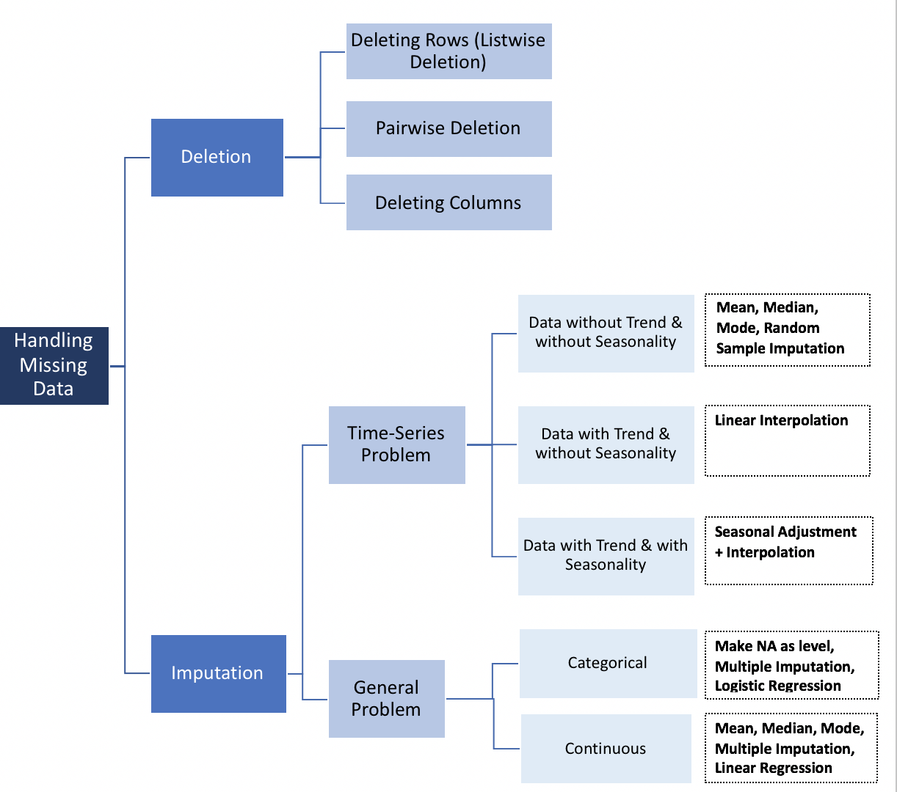

Before we start building the machine learning model, there are some questions we should ask ourselves first.

## Setting up the environment

First we need to set up how we want our output to look (knitr, a feature of R Markdown, will take care of this for us) and install/load the R packages we will need for our experiment today.

**PRO-TIP: you can execute a single line of code with the shortcut 'Ctrl+Enter' or a whole chunk of code with 'Ctrl+Shift+Enter'**

```{r setup, results='hide'}


#install.packages("caret")
#install.packages("mlbench")
#install.packages("tidyverse")
#install.packages("caretEnsemble")
#install.packages("skimr")
#install.packages("RANN")


library(tidyverse) # collection of packages for easy data import, tidying, manipulation and visualization
library(skimr) # package for getting dataset stats at a glance
library(caret) # package for "Classification And REgression Training"
library(caretEnsemble)
library(RANN) # required for some caret functions

library(mlbench) # package for benchmarking machine learning models


setwd("/stor/work/Marcotte/project/rmcox/github_repos/pokemon_machine_learning_demo/")

```


## Importing and exploring the data

Next we will need to load the Pokemon data into our environment. This is a publicly available dataset scraped a couple years ago from http://serebii.net/ and contains information on the 802 Pokemon comprising Generations 1-7. 

The information contained in this dataset include Base Stats, Performance against Other Types, Height, Weight, Classification, Egg Steps, Experience Points, Abilities, etc.

**PRO-TIP: you can make a pipe (%>%) with the shortcut 'Ctrl+Shift+M'**

```{r data exploration and preprocessing}

# The read_csv() function loads in the data and automatically detects it as comma-delimited.
poke_data <- read_csv("pokemon_data_all.csv", col_names=TRUE) %>%
  select(name, everything()) 

# The glimpse() function is nice for looking at all the variable names and types.
# You can see there are 801 pokemon ("observations") and 41 features ("variables").
glimpse(poke_data) 

# The head() function lets us look at the first few rows of the dataframe and its format.
head(poke_data)

# Luckily our dataset is already in the right format, with individual observations as rows and features as columns.
# If this were not the case, we would have to use gather() or spread() to get it in the right format.

# Some of these variables are not going to be helpful for training our model. E.g., "name" is always unique, "japanese name" is always unique, "abilities" are nearly always unique and "classification" are nearly always unique. Let's take these out for simplicity's sake. Also, for some reason "capture_rate" is described with numeric values but is labeled a character value. Let's change that:
poke_data <- poke_data %>%
  select(-japanese_name, -abilities, -classfication) %>% 
  mutate(capture_rate = as.numeric(capture_rate)) 

ggplot() +
  geom_bar(data=poke_data, stat="count", aes(x=type1, fill=is_legendary)) +
  #geom_bar(aes(fill=is_legendary)) +
  coord_flip()
  #theme(axis.text.x = element_text(angle = 90, hjust = 0))

# Let's explore the distrbution of our target variable and see if there is any class imbalance.
ggplot(poke_data, aes(x=is_legendary)) +
  geom_bar() +
  scale_x_continuous(breaks=0:1, 
                     labels=c("Non-Legendary","Legendary")) +
  ylab("Number of Pokemon") +
  xlab("")

poke_data %>% tally(is_legendary > 0)

# It looks like the dataset is pretty imbalanced.
# This is another common issue in datasets used for classification.
# We'll come back to that later.

# The next step is to look for missing data, a common problem in big datasets. The skimr package provides a nice solution for this, along with showing key descriptive stats for each column.
skim(poke_data)

# Looks like we have a little bit of missing data. Let's explore that a little further.

# In our columns with character values, almost half the data set is missing a value for "type2."
# If you're familiar with Pokemon, you know that's perfectly valid for a Pokemon to only have one type.
# Since the characteristic of only having one type might be important to a Pokemon's legendary status, we can feel justified in replacing all the "NA" values in the "type2" column to "none."
poke_data$type2[is.na(poke_data$type2)] <- "none"

# Let's see how that changes our skimmed output.
skim(poke_data)

# We also have missing values in our numeric columns. Let's check out how many legendary Pokemon are affected by this missing data.
poke_data %>% filter(is.na(weight_kg)) %>% tally(is_legendary > 0)
poke_data %>% filter(is.na(height_m)) %>% tally(is_legendary > 0)
poke_data %>% filter(is.na(percentage_male)) %>% tally(is_legendary > 0)

# 63/70 legendary Pokemon are missing a value for the "percentage_male" feature!

```

## Dealing with missing data

There is no one-size-fits-all method for dealing with missing data. I found a nice overview for the different ways you can deal with missing values in predictive analytics in a data science blog (https://towardsdatascience.com/how-to-handle-missing-data-8646b18db0d4):



Missing values in the "percentage_male" column is particularly problematic, since there are a lot of legendary Pokemon in this subset. The reason for this is that legendary Pokemon are commonly genderless. 

We can't replace N/A with "none" like we did with the types above, because then we would be mixing numeric and character values. We can't replace N/A with 0, because then that would imply 100% female, which is false. We can't impute it, because it will predict a value between 0 and 100, which is also incorrect.

In real life, I would figure out a different way to measure the gender distribution for each specimen (or lack there of). In my opinion, it is generally always better to keep data than discard it... but since this is a silly demo I'm just going to delete this column ¯\_(ツ)_/¯

The missing values in the "weight_kg" and "height_m" columns are less complex to deal with. These missing values represent a smaller portion of the dataset, and result from a bug in the web scraping script used to generate the csv.

Let's take this as an opportunity to demonstrate what imputation might look like. We can impute the missing values by considering the rest of the available variables as predictors using the k-Nearest Neighbors algorithm. Luckily caret has a built-in function for this, preProcess(). 

Before we do that, we need to partition our data into training and test sets. We want our test set to be **completely independent** of our training set, and that includes participation in imputation.

## Splitting the dataset for training and testing

We need to split the dataset into training data (80%) and test data (20%). When building the predictive model, the algorithm should see the training data and **ONLY** the training data to learn the relationship between Pokemon stats and their legendary status. Learned information about these relationships become our machine learning model.

```{r partition data set}

# Let's remove the problematic "percentage_male" column. Warning: This is not (~generally~) advised in real life predictive analytics, I'm doing it here because (1) time constraints and (2) laziness. I'm also going to take out "japanese_name" for simplicity's sake.
poke_data <- poke_data %>%
  select(-percentage_male) 

# Now let's divide the dataset into training and test sets. The caret package has a nice function, createDataPartition(), for this purpose.

set.seed(13)

partition_index <- createDataPartition(poke_data$is_legendary, p=0.8, list=FALSE)

trainPoke <- poke_data[partition_index,]

testPoke <- poke_data[-partition_index,]

```


```{r missing data}

# The "name" column is not important to model training, so let's take it out to avoid having to encode the labels.
trainPoke <- trainPoke %>%
  select(-name) %>%
  mutate(is_legendary = as.factor(is_legendary))

# Now let's make a model for predicting the missing values in the weight and height columns.
poke_missingdata_model <- preProcess(trainPoke, method='knnImpute')

poke_missingdata_model

# The output shows that the model has centered (substracted by mean) 34 variables, ignored 3 variables, used k=5 (considered 5 nearest neighbors) to predict missing values and finally scaled (divide by standard deviation) 34 variables.

# Now let's use this model to predict the missing values.
trainPoke <- predict(poke_missingdata_model, newdata = trainPoke)

# Check to see if any N/A values remain. If FALSE, all values have been successfully imputed.
anyNA(trainPoke)

# We can also revisit the skim() function to confirm no missing values are present.
skim(trainPoke)

```

## Categorical variables in machine learning

Categorical data are variables that contain label values rather than numeric values. For instance, Pokemon types are labels like "fairy" and "fire." Many machine learning algorithms cannot operate on label data directly, requiring all input and output variable to be numeric.


## Training and tuning the model

```{r model training and tuning}

fitControl <- trainControl(method="repeatedcv", number=5,
                           repeats=10)

tic("Bagged CART")
# fit a "Bagged CART (Classification and Regression Tree)" model; 48.536 seconds
pokeFit_tb <- train(is_legendary~., data=trainPoke, method = "treebag",
                 trControl=fitControl)
toc()

tic("Random Forest")
# fit a "Random Forest" model; 206.871 seconds
pokeFit_ranf <- train(is_legendary~., data=trainPoke, method = "cforest",
                    trControl=fitControl)
toc()

tic("Random Forest by Randomization")
# fit a "Random Forest by Randomization" model; 204.94 seconds
pokeFit_ranf_extrees <- train(is_legendary~., data=trainPoke, method = "cforest",
                    trControl=fitControl)
toc()

tic("Rotation Forest")
# fit a "Rotation Forest" model (classification only); 208.361 seconds
pokeFit_rotf <- train(is_legendary~., data=trainPoke, method = "cforest",
                    trControl=fitControl)
toc()

```

############################################################################################
## Scratch notes below here
############################################################################################

```{r dummy variables}

str(trainPoke)

# Convert categorical variables to as many binary variables as there are categories
dummyPoke_model <- dummyVars(is_legendary~., data=trainPoke)

# Create dummy variables using predict
trainPoke_encoded <- predict(dummyPoke_model, newdata=trainPoke)
trainPoke_encoded

```

## Feature engineering

```{r feature selection}

featurePlot(x=trainPoke_encoded, y=trainPoke_encoded$is_legendary,
            plot="box",
            strip=strip.custom(par.strip.text=list(cex=.7)),
            scales = list(x = list(relation="free"), 
                          y = list(relation="free")))

```